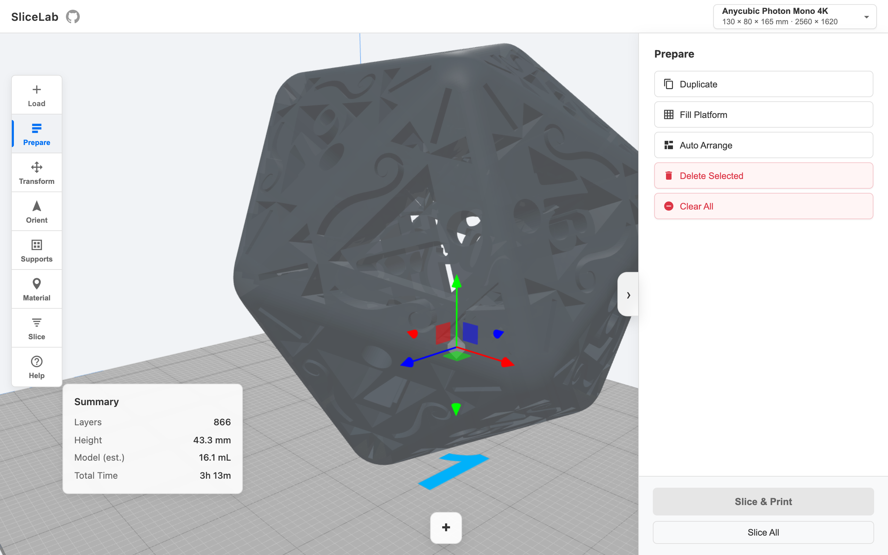

# SliceLab

A browser-based SLA/DLP resin slicer that runs entirely in your browser. No installs, no accounts, no backend — open it and start slicing.

This is a personal testbed for exploring SLA slicing workflows: orientation algorithms, support generation strategies, GPU-accelerated layer slicing, and whatever else comes to mind. It's not trying to replace ChiTuBox or Lychee — it's a playground for pushing what's possible in a browser tab.

**[Try it live →](https://szabadkai.github.io/slicer/)**



---

## What it does

| Workflow step | Capabilities |
|---|---|
| **Load** | Drag-and-drop STL / STEP / IGES onto the viewport, or browse. Sample models included. Multi-plate projects with IndexedDB autosave. |
| **Orient** | Genetic algorithm evaluates 26+ candidate orientations. Three presets: Fastest / Least Support / Best Quality. Custom multi-objective weight sliders (height, overhang, staircase, flat surface). Batch orient-all. Surface intent biasing. |
| **Modify** | Hollow with configurable wall thickness. Smart drain-hole placement with resin trap analysis and drain plugs. Boolean cut/subtract/split with box, sphere, cylinder, and cone primitives. Model grouping and ungroup. |
| **Supports** | Overhang angle threshold, auto-density, cross-bracing, base pans with configurable lip. Manual click-to-place pillars. Intent-aware generation. Live unsupported-areas overlay. |
| **Surface** | Brush-paint surface intents (cosmetic, hidden, reliability-critical, removal-sensitive). Six fill patterns: solid, carbon fiber, knurl, ribbed, noise, bumps. Volume paint with primitive shapes. |
| **Inspect** | Mesh health score. Non-manifold edge highlighting, inverted normals, degenerate triangles, duplicate vertices. Wall-thickness heatmap. Support-stress heatmap. Auto-repair. Two-click distance measurement with ΔX/Y/Z. |
| **Material** | 21 resin presets — Siraya Tech, Anycubic, Elegoo — with PBR visual preview in the 3D viewport. |
| **Slice** | GPU-accelerated stencil-buffer slicing (WebGL, Formlabs-style). Three built-in profiles (Fast / Standard / High Detail) plus save/delete custom profiles. Adaptive layer height based on surface angle. Dimensional compensation. Per-region exposure with surface intent. Gyroid infill option. |
| **Preview** | Real-time layer scrubbing. Peel-force profile chart. Island detection (unsupported floating regions). Layer inspector with zoom and cross-section area graph. |
| **Export** | STL, OBJ, 3MF mesh export. Sliced PNG layer archive (ZIP) with metadata. Batch export across all plates. |

---

## Typical workflow

1. **Open** [the live version](https://szabadkai.github.io/slicer/) — a sample d20 loads automatically so you have something to work with right away.
2. **Load** your model — drag an STL onto the viewport or click **Load** and browse. STEP and IGES files are supported too.
3. **Set your printer** from the dropdown in the top bar. This sets the build volume and resolution used for slicing.
4. **Orient** — open the Orient panel, pick a preset. *Least Support* is a good default. The algorithm runs in seconds and repositions your model.
5. **Generate supports** — open Supports, click **Auto-Generate**. Enable *Show unsupported areas* to check coverage. For tricky geometry, switch to *Manual Placement* and click to add individual pillars.
6. *(Optional)* **Hollow** — open Modify → Hollow, set wall thickness (2 mm is a safe minimum for most resins), then use *Auto-Place Drain Holes* and run *Trap Analysis* to prevent pooling.
7. **Inspect** — open Inspect and run *Analyze*. Fix any issues flagged in red before slicing.
8. **Slice** — open the Slice panel, choose a profile (Standard works for most prints), then press `Ctrl+S`. Scrub through the layer preview and run *Detect Islands* to catch unsupported geometry.
9. **Export** — click **Export…** to download a ZIP with all PNG layers and a metadata file, ready for your printer's software.

> Press `?` at any time to see all keyboard shortcuts.

---

## Keyboard shortcuts

### General
| Key | Action |
|---|---|
| `H` | Toggle right panel |
| `Esc` | Close dialogs / cancel active tool |
| `?` | Show shortcuts |

### Selection
| Key | Action |
|---|---|
| `Ctrl+A` | Select all |
| `Ctrl+D` | Duplicate selected |
| `Ctrl+C` / `Ctrl+V` | Copy / Paste |
| `Ctrl+Z` | Undo |
| `Del` | Delete selected |

### Arrangement
| Key | Action |
|---|---|
| `G` | Auto-arrange (single) / Distribute (multi) |
| `Ctrl+Shift+A` | Auto-arrange / Distribute |
| `F` | Fill platform with copies |

### Tool panels
| Key | Action |
|---|---|
| `1` | Layout panel |
| `2` | Transform panel |
| `3` | Orient panel |
| `4` | Hollow panel |
| `5` | Supports panel |
| `6` | Materials panel |
| `7` | Paint panel |
| `8` | Inspect panel |
| `9` | Slice panel |
| `Tab` | Next panel |
| `Space` | Cycle transform mode |

### Slicing & export
| Key | Action |
|---|---|
| `Ctrl+S` | Slice active plate |
| `Ctrl+Shift+S` | Slice all plates |
| `Ctrl+E` | Export active plate |
| `Ctrl+Shift+E` | Export all plates |

### Layer inspector
| Key | Action |
|---|---|
| `←` / `→` | Previous / next layer |
| `PgUp` / `PgDn` | Skip 10 layers |
| `Home` / `End` | First / last layer |

---

## Guides

User-facing how-to guides live in [`docs/guides/`](docs/guides/README.md):

| Guide | Covers |
|---|---|
| [Orientation](docs/guides/orientation.md) | How the genetic algorithm works, presets, custom weights, surface intent biasing |
| [Supports](docs/guides/supports.md) | Overhang angle, auto vs manual placement, cross-bracing, base pans |
| [Hollow & Drain](docs/guides/hollow-and-drain.md) | Wall thickness, drain holes, resin trap analysis |
| [Slicing & Profiles](docs/guides/slicing-and-profiles.md) | Layer height tradeoffs, built-in profiles, adaptive layers, compensation |
| [Layer Inspection](docs/guides/layer-inspection.md) | Islands, peel-force chart, diff mode, area graph |
| [Mesh Health](docs/guides/mesh-health.md) | Non-manifold edges, inverted normals, what auto-repair fixes |
| [Exporting](docs/guides/exporting.md) | PNG-ZIP format, metadata file, mesh export formats |

> The in-product tour links directly to the relevant guide for each workflow step.

---

## Getting started (development)

```bash
npm install
npm run dev        # http://localhost:5173
npm test           # run Vitest once
npm run typecheck  # tsc --noEmit
npm run lint       # ESLint
```

Or just open the **[live version](https://szabadkai.github.io/slicer/)** — nothing to install.

---

## Architecture

SliceLab uses a **feature-sliced layout**: every capability lives in `src/features/<name>/` and imports only from `src/core/`. Features never import from each other.

```
src/
  core/            shared state (signals), types, viewer-service, commands
  features/
    app-shell/     toolbar, keyboard shortcuts, preferences, autosave
    auto-orientation/
    gpu-slicing/
    hollow-drain/
    layer-preview/
    material-and-printer-profiles/
    mesh-health/
    model-io/
    model-transform/
    multi-plate-project/
    paint-tool/
    primitive-boolean/
    scene-viewer/
    support-generation/
    surface-intent/
    onboarding/
  main.ts          ≤ 100 lines — bootstrap only
```

**Key conventions:**
- Every feature exports a `mount*(rootEl, ctx)` function — no side-effects at import time
- Reactive state via `@preact/signals-core` (`signal`, `computed`, `effect`)
- No `any` — use `unknown` + type guards; explicit return types on all exports
- Files ≤ 600 lines; split by concern: `panel.ts` (UI), `engine.ts` / `ops.ts` (logic), `worker.ts` (async)
- Path aliases: `@core/*`, `@features/*`
- `three` imports only inside `src/core/viewer-service.ts` and `src/features/gpu-slicing/`

See `CONTRIBUTING.md` for the progress bar / thread-yielding directive.

---

## License

MIT
